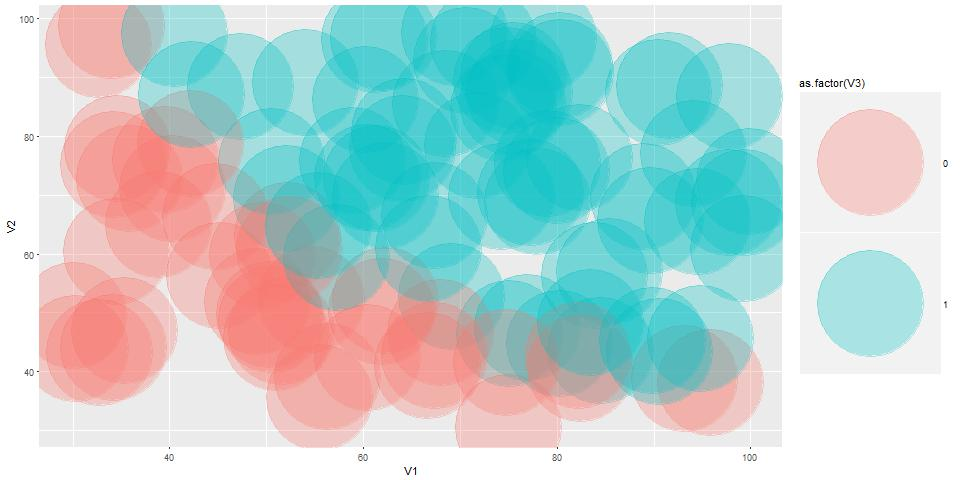

Solución al reto Admisiones
===========================

El objetivo del reto es construir un algoritmo que prediga si un
estudiante va a ser admitido a partir del desempeño académico en dos
evaluaciones. Para mayor información visitar [Reto
Admisiones](https://github.com/charlielito/supervised-basico-admission-exams)

Software
========

    version$version.string

    ## [1] "R version 3.3.2 (2016-10-31)"

Lectura de datos
================

    train <- read.csv("train-set.csv", header = FALSE)
    test <- read.csv("test-set.csv", header = FALSE)

Selección del modelo - Gráfico exploratorio
===========================================

El siguiente gráfico muestra que es necesario un algoritmo de
clasificación no lineal debido a que hay una leve curvatura. De esta
manera se elige como algoritmo: Support Vector Machine (SVM)

    #Libreria con el sistema de gráficación ggplot2
    library(ggplot2)

    #Gráficos
    ggplot(train, aes(x=V1, y =V2, 
                      col = as.factor(V3))) +
            geom_point(alpha=0.3, lwd=50)

Entrenamiento del modelos
=========================

    #Libreria para estimar SVM
    library(e1071)

    ## Warning: package 'e1071' was built under R version 3.3.3

    #Super vector machine
    set.seed(3)
    resultado <- tune(svm, as.factor(V3) ~., data = train,
                      kernel = "radial",
                      ranges = list(cost= c(0.1 ,1 ,10 ,100 ,1000),
                                    gamma = c(0.5,1,2,3,4)))

Precisión con datos de entrenamiento y Precisión con datos de prueba.
=====================================================================

El algoritmo alcanza una precisión de 100% con la base de datos de
entrenamiento, y una precisión del 95% con la base de datos de prueba.

    #Training precition
    p <- predict(resultado$best.model, train)
    mean(p==as.factor(train$V3))*100

    ## [1] 100

    #Test precition
    pt <- predict(resultado$best.model, test)
    mean(pt==as.factor(test$V3))*100

    ## [1] 95
